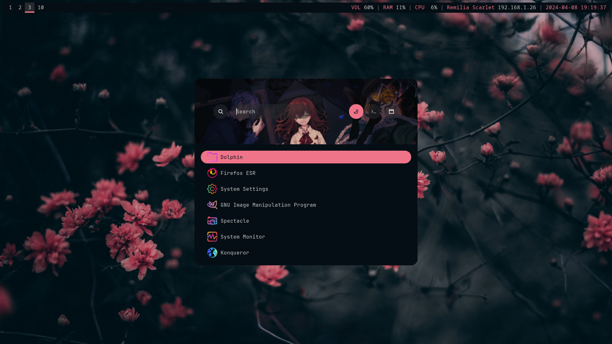
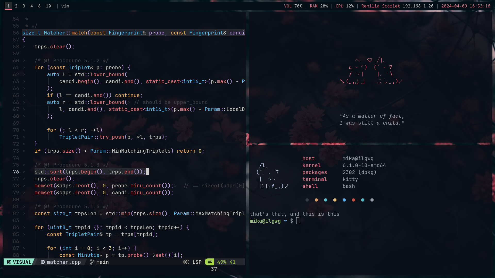
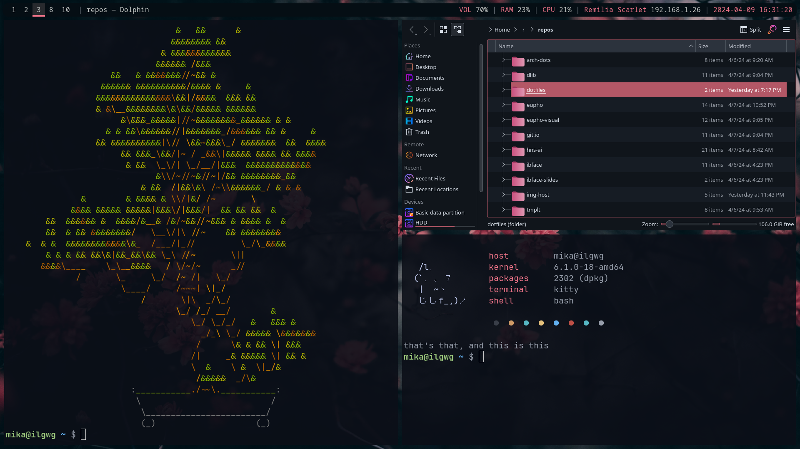
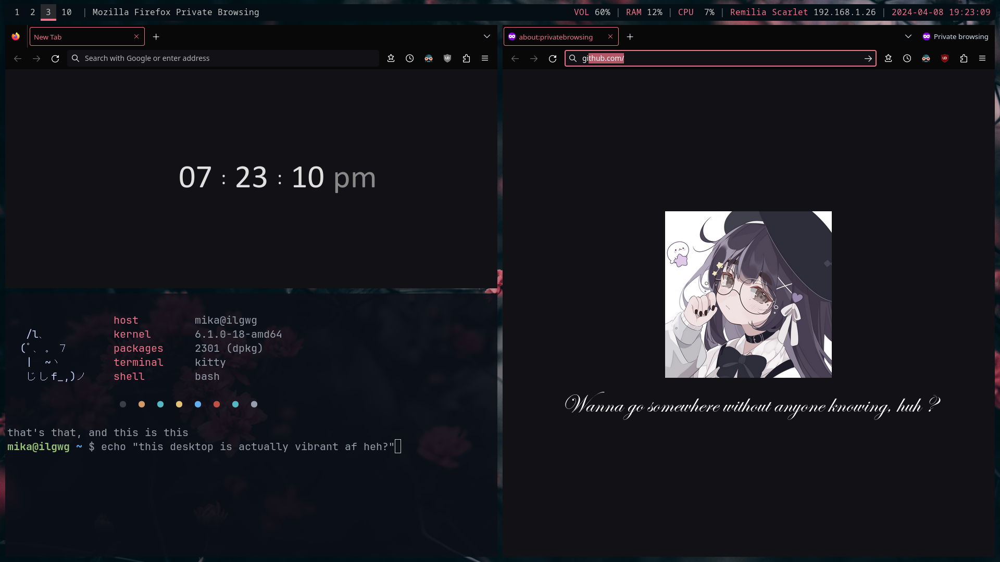
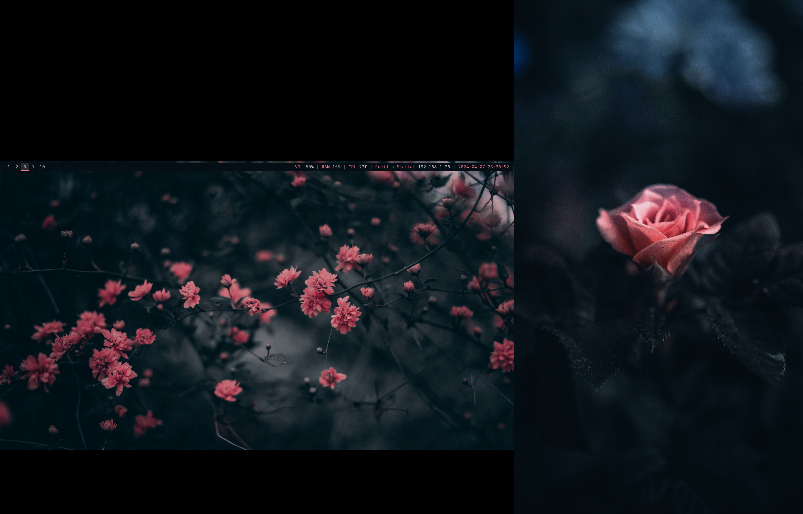
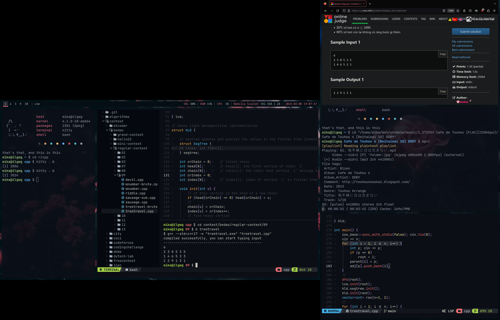

# My dotfiles

This is my very simple i3wm dotfiles, focusing on the arrangement of high-contrast colors---which I believe aren't appreciated enough. Vibrant scarlet set against a deep, cold dark-blue background... I just love it so much.

By the way, this dotfiles is hard coded for dual monitors, so please edit `./profile` (line 8-9) and `./.config/i3/config` (search for line with `workspace 1 output DP-0`) before applying this dotfiles on other systems.

# Showcase





<details>
    <summary>Show more</summary>

    

    

    

    
</details>

# Color Palette

|                         |                                                                    |
| ----------------------- | ------------------------------------------------------------------ |
| Primary Theme Color     |  `#F07489` |
| Secondary Theme Color   |  `#B35766` |
| Alternate Theme Color   |  `#F0C674` |
| Foreground Color        |  `#C5C8C6` |
| Background Color        |  `#050E14` |
| Brighter Background     |  `#10151B` |
| Highlighted Background  |  `#282A2E` |

This rice uses "Primary Theme Color" for scarlet foreground and "Secondary Theme Color" for scarlet background.

# Installation

The installation of this dotfiles consists of 3 steps:

## Step 1: Clone

You may clone this repository using:

```sh
git clone --depth 1 https://github.com/iluvgirlswithglasses/dotfiles
```

## Step 2: Copy Files

Once you've done the previous step, just copy everything in this repository to the home directory. Dependencies are:

```sh
sudo apt install kitty fish nvim i3 feh rofi polybar xsel compton gtk3-nocsd flameshot pipewire
```

Additional dependencies:

- [macchina](https://github.com/Macchina-CLI/macchina), whose executable file is also included here in `./.local/bin`
- NerdFonts. If you use Debian, I suggest you install them via [this repository](https://github.com/ryanoasis/nerd-fonts)

## Step 3: Further customization

It should be noted that firefox extensions and KDE themes won't install on their own. For the "pinky" theme as showcased:

1. Make sure `./.local/share/*` is copied to `~/.local/share/`
2. Use KDE System Settings to load my color scheme (iluv-sakura) and my icons (iluv-icons) for GTK and KDE apps
3. Follow the guide in `./.mozilla/README.md` to theme Firefox

That should be all.

# Bonus

Icons credit goes to [Eliver Lara](https://github.com/EliverLara/candy-icons).

Rofi credit goes to [Aditya Shakya](https://github.com/adi1090x/rofi).

My nvim configuration is in [this repository](https://github.com/iluvgirlswithglasses/nvim). It uses NvChad v2.0.

The tool I used for printing two lovey-dovey cats is [here](https://github.com/iluvgirlswithglasses/terminal-tools).

Also, here's my [hyprland dots](https://github.com/iluvgirlswithglasses/dots-hyprland)!

